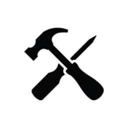

<h1 align="center">Multitool</h1>

-A mod that lets you change the current round, the amount of cash you have, and the amount of lives you have!

Controls:
  F6: Change Round
  F7: Change Money
  F8: Change Health

